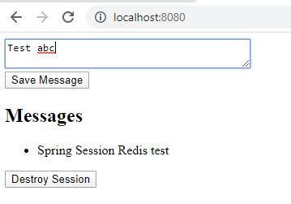
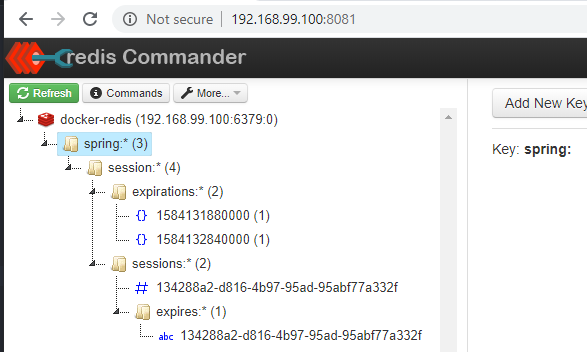

# Spring Session example with Redis
This code example is using Spring Session + Redis as Session management.


# Getting Started

To run the test, you need a redis server. In this example, it is assumed you have a Redis server
in Docker Images(with IP 192.168.99.100). Run the Redis Images from Docker with following command
```
docker run --name some-redis -p 6379:6379 -d redis
docker run --rm --name redis-commander -d --env REDIS_HOSTS=docker-redis:192.168.99.100:6379 -p 8081:8081 rediscommander/redis-commander:latest
```
NOTE: If you want to see the cache status, you can use redis-commander interface above. `http://192.168.99.100:8081`

# Run the example application
Play around on `http://localhost:8080/` then see the Redis-Commander 
to see the session added into the Redis server.

* Test web application


* Redis-Commander


### The property setup
```yaml
server:
  servlet:
    session:
      timeout: 1800
spring:
  session:
    store-type: redis
    redis:
      flush-mode: on_save
      namespace: spring:session
  redis:
    host: 192.168.99.100
    port: 6379
```


---
### Reference Documentation
* [https://www.javainuse.com/spring/springboot_session](https://www.javainuse.com/spring/springboot_session)
* [https://docs.spring.io/spring-session/docs/current/reference/html5/guides/boot-redis.html](https://docs.spring.io/spring-session/docs/current/reference/html5/guides/boot-redis.html)


